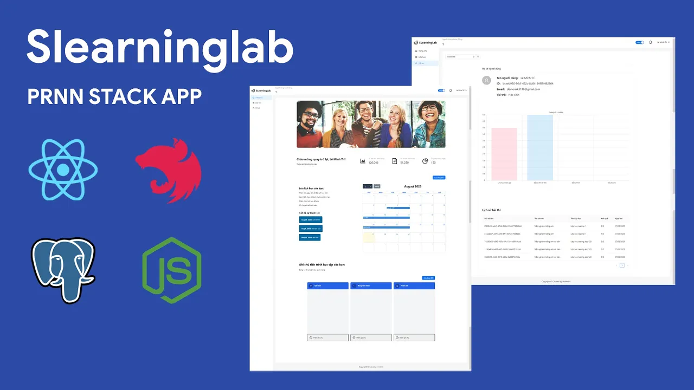

# SLEARNING LAB SERVER DOCUMENTATION



🎓 📚 Education & Learning support project app inspired from [Google classroom](https://classroom.google.com)

This project includes two repository (Client and Server), you can checkout **[client repository](https://github.com/minhtrifit/slearninglab-client)**

## 💻 Technical Stack
<p align="left"> <a href="https://nestjs.com/" target="_blank" rel="noreferrer">  </a> <a href="https://www.postgresql.org" target="_blank" rel="noreferrer">  </a> </p>

- [Nest.js](hhttps://nestjs.com) - A progressive Node.js framework for building efficient, reliable and scalable server-side applications.
- [PostgreSQL](https://www.postgresql.org) - The World's Most Advanced Open Source Relational Database

## ⚙️ Config .env file

Config [.env]() file in root dir with path `./.env`

```bash
CLIENT_URL=yourclienturl
DB_HOST=yourdbhost
DB_PORT=yourdbport
DB_USERNAME=yourdbusername
DB_PASSWORD=yourdbpassword
DB_NAME=youdatabasename
JWT_KEY_SECRET=yourjwtkey
JWT_ACCESS_KEY=youraccesskey
JWT_REFRESH_KEY=yourrefreshkey
AUTH_EMAIL_USER=youremail@gmail.com
AUTH_EMAIL_PASSWORD=youremailpassword
```

## 📦 Installation

Intall packages & dependencies
```console
npm install
```

Or install packages with legacy peer dependencies.
```console
npm install --legacy-peer-deps
```

Run server project

```bash
# development
$ npm run start

# watch mode
$ npm run start:dev

# production mode
$ npm run start:prod
```

Test server project

```bash
# unit tests
$ npm run test

# e2e tests
$ npm run test:e2e

# test coverage
$ npm run test:cov
```

Run server project with Dockerfile

```bash
$ docker run -p 5500:5500 slearninglab-api:1.0.0
```

## ▶️ YouTube Demo

[](https://youtu.be/g9WHplySekY)

## 💌 Contact

- Author - [minhtrifit](https://minhtrifitdev.netlify.app)
- [Github](https://github.com/minhtrifit)

> CopyRight© minhtrifit
